# More info

- Slides: [johncolby.github.io/acgme_talk](https://johncolby.github.io/acgme_talk)
- Repo: [github.com/johncolby/acgme_talk](https://github.com/johncolby/acgme_talk)

```{r xaringan-logo, echo=FALSE}
xaringanExtra::use_logo(
  image_url = "img/logo.png",
  link_url = 'https://radiology.ucsf.edu',
  position = xaringanExtra::css_position(bottom = "-1.5em", right = "1em")
)
```

???
- We are going to talk about a few general topics in deep learning, with the goal of building your intuition about these methods that are becoming increasingly intertwined in our world of medical image analysis.
- All these slides are up on github.
- Lots of links to the underlying material.

---
# Rocket science

.center[
    <iframe width="853" height="505" src="https://www.youtube.com/embed/pMsvr55cTZ0?start=15805" frameborder="0" allow="accelerometer; autoplay; encrypted-media; gyroscope; picture-in-picture" allowfullscreen></iframe>
]

???
- I want to start by drawing a loose parallel to space exploration, which similarly has seen large advances over the past 50 years.
- Advances in space flight and deep learning were both dependent on important *theoretical* challenges and *engineering* challenges.
- However, while it still costs around 100k to launch a 10 cm cubesat, anybody can sit down in their living room with a laptop and spin up a SOTA deep learning model. 

---
# Neural network
.pull-left[
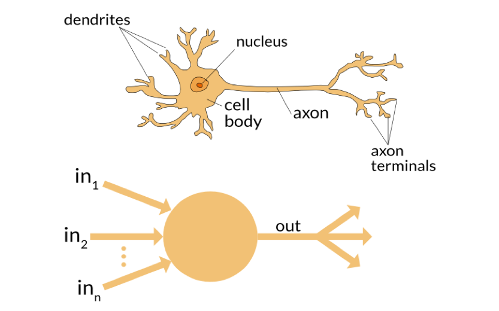
]
.pull-right[
[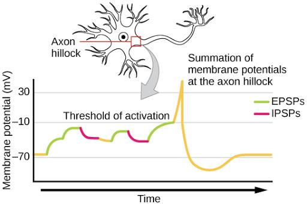](http://bio1520.biology.gatech.edu/chemical-and-electrical-signals/neurons/)
]

???
- The *neural* in neural network gets its loose inspiration from actual neurobiology. We're not talking about some fancy neurobiological model, but more like the freshman year neuroscience variety.
- Each neuron or node in the network receives various inputs from other nodes.
- Different weights (e.g. some inhibitory).
- These are integrated and then pumped through some nonlinear activation function. For example, this all or non threshold of activation for generating an action potential.

---
# "Neural" network
[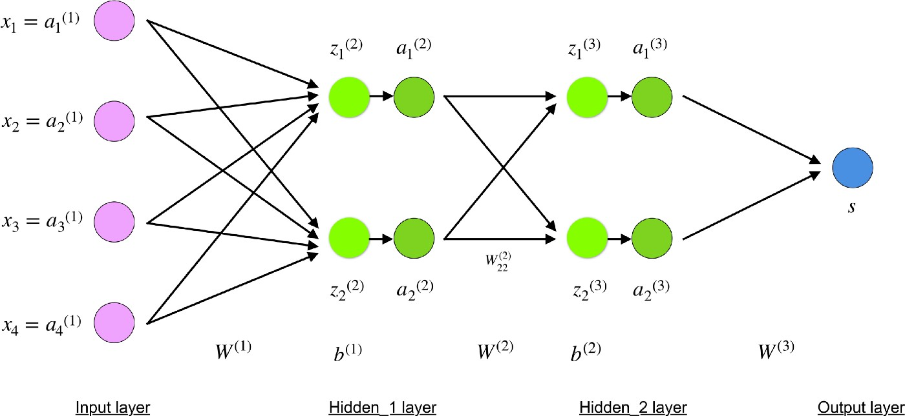](https://towardsdatascience.com/understanding-backpropagation-algorithm-7bb3aa2f95fd)

???
- Now let's consider an artificial neural network.
- Again you have neuron that receives multiple weighted inputs. 
  - For example, in the glioblastoma tumor segmentation context, you have 4 inputs (T1 pre and postcontrast, T2, FLAIR). We know contrast enhancement is very important, so this neuron might have strong weights for pre and post (a sort of subtract map). 
  - We might imagine a second neuron here that activates preferentially to FLAIR.
  - Maybe another one incorporates T1 and T2 to help differentiate watery infiltrative tumor and edema from just T2 bright postsurgical blood products.
- All these neurons are not created equal, so we typically incorporate some bias term (i.e. offset or intercept) which affects their sensitivity to firing.
  - This would be like sliding the resting membrane potential closer to the activation threshold in the biological analogy.
- Now, just like in simple linear modeling, you can imagine that these first order neurons, themselves, may interact. For example, I am going to be more apt to call tumor progression if I see BOTH suspicious FLAIR and suspicious enhancement characteristics.
- At the end of the network, we are going to have an output node, which maps these interesting features we've extracted to some useful or interpretable output space, such as probability of tumor progression.

---
class: inverse
background-image: url(img/plinko.png)

# Intuition

???
- Our ultimate goal is to train or learn a set of little filters or feature extractors that are going to be useful for or clinical question of interest.
- A great analogy to think of is this Plinko board from the price is right. You drop your input data in the top, and our job would be to adjust (train) these little pegs such that as the input data filter through the network, at all these deepening layers, we could eventually classify them automatically into piles of say tumor progression on this side and posttreatment change on this side.

---
.video-container[
    <iframe src="https://www.youtube.com/embed/3r0P3CSYI-U" frameborder="0" allow="accelerometer; autoplay; encrypted-media; gyroscope; picture-in-picture" allowfullscreen></iframe>
]

???
I was pretty proud of myself for thinking of that analogy, but that sense of physical programming is exactly what these guys came up with in this game called “Turing Tumble”. 

---
# Linear regression

$$\mathbf{y} = \mathbf{x} b_1 + b_0 + \boldsymbol\varepsilon$$
$$\mathbf{y} = X\boldsymbol\beta + \boldsymbol\varepsilon$$

.whole-block[].vmiddle[
[
```{r echo=FALSE, out.width="50%"}
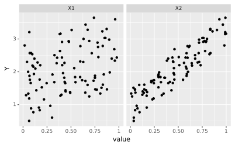
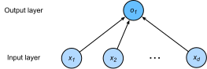
```
](https://d2l.ai/chapter_linear-networks/linear-regression.html)
]

???
- Now we are going to move on and consider the simple case of a linear regression model.
- In the most basic version, we may have a single input predictor, which is related to your output by a single weight (slope) and intercept (bias).
- In any real world system (e.g. medicine), we are more used to considering the case of multiple regression, where your output is related to *multiple* input variables, each with their own weight.
  - For example, real estate pricing may relate to both square footage *and* distance from airport/freeway/etc..
- Now in this case, we can (and in practice do) find the optimum solution analytically through simple linear algebra solving for beta.
- For learning sake, through, we can reframe this problem as a simple 2 layer neural network, where the nodes in our input layer (input variables/predictors i.e. sqft and distance from airport) are connected to our output layer (home price) as their weighted sum governed by these beta coefficients.

---
# Loss function

<script type="text/x-mathjax-config">
MathJax.Hub.Config({
    jax: ["input/TeX","output/HTML-CSS"],
    displayAlign: "left"
});
</script>

- For linear regression: [Mean square error](https://en.wikipedia.org/wiki/Mean_squared_error) aka L2 loss $$MSE=\frac{1}{n} \sum_{i=1}^n (y_i-\hat{y}_i)^2$$

.center[
[
```{r echo=FALSE, out.width="70%"}
knitr::include_graphics('img/least_squares.png')
```
](https://www.jmp.com/en_us/statistics-knowledge-portal/what-is-regression/the-method-of-least-squares.html)
]

???
- This brings us to the *learning* in deep learning, or, in this context, the *intelligence* in artificial intelligence: *How* do we optimize these weights to get the best model.
- Sticking with our linear regression example, I'm sure we all remember the method of least squares from high school statistics.
- If we consider the error in our model, which is the difference between our predicted (yhat) and observed (y) values, then our goal is to tweak these model weights such that the mean of the squared errors is as small as possible.

---
# Backpropagation 

- [Chain rule](https://www.mathbootcamps.com/the-chain-rule) on steroids: $f'(a) = f'(x(a)) x'(a)$

.whole-block[].vmiddle[
[
```{r echo=FALSE, out.width="50%"}
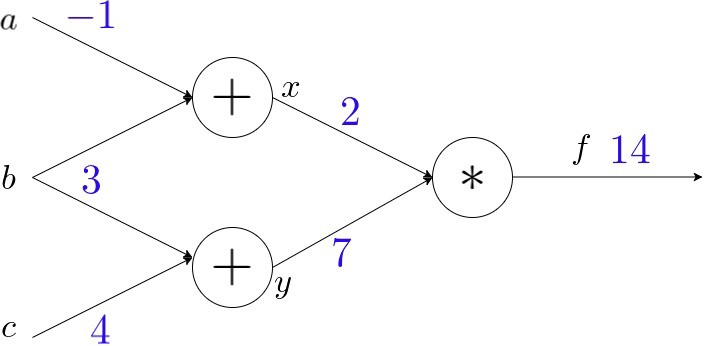
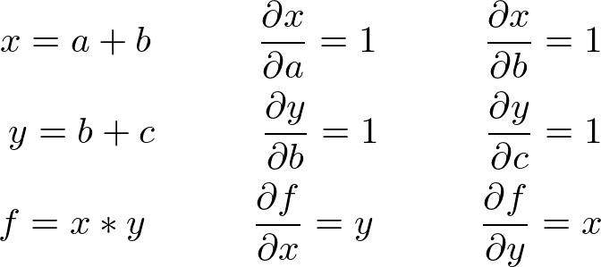
```
](https://medium.com/spidernitt/breaking-down-neural-networks-an-intuitive-approach-to-backpropagation-3b2ff958794c)
]

???
- In order to determine how to tweak these weights, we can calculate the first derivative (or gradient) of our loss function, and then simply follow the path of steepest descent.
- This is trivial in the toy 2 layer case, however quickly becomes burdensome as you begin to consider dozens of layers, each with dozens of nodes.
- To do this, we are going to rely on our little friend the chain rule from Calculus AB, which allows us to compute the derivative of a complex composite function in terms of the derivatives of its simpler component functions. 
- This method of recursive application of the chain rule, together with an efficient computation algorithm for doing so, is called backpropagation. i.e. backpropagating the derivatives/gradients from the final loss through all the layers to all the weights in the entire model.

---
# Backpropagation 

.center[
[
```{r echo=FALSE, out.width="80%"}
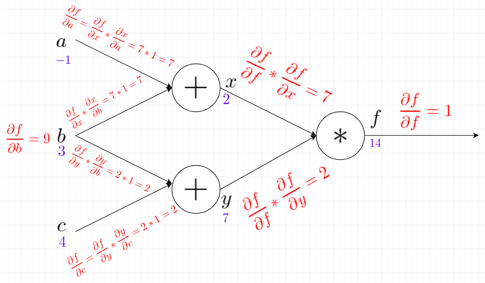
```
](https://medium.com/spidernitt/breaking-down-neural-networks-an-intuitive-approach-to-backpropagation-3b2ff958794c)
]

???
Worked example...


---
# Optimization (gradient descent)

.pull-left[
[
```{r echo=FALSE, out.width="100%"}
knitr::include_graphics('img/gradient_descent.png')
```
](https://ml-cheatsheet.readthedocs.io/en/latest/gradient_descent.html#introduction)
]
.pull-right[
[
```{r echo=FALSE, out.width="100%"}
knitr::include_graphics('img/gradient_descent_demystified.png')
```
](https://ml-cheatsheet.readthedocs.io/en/latest/gradient_descent.html#introduction)
]

???
- We talked about our loss function (e.g mean squared error in least squares) that we are going to try to optimize
- We also talked about how to calculate the derivatives or gradients of that loss function with respect to the weights in our model.
- Now we simply need to take a step in the right direction.
- Using the nice topological analogy, we're going to head straight down the fall line.
- As a side note, you need to tune your learning rate, or step size, such that you don't overstep your minimum, or wiggle out of the valley completely.

---
# Deep learning linear regression

.center[
    <iframe src="https://player.vimeo.com/video/425177714" width="853" height="505" frameborder="0" allow="autoplay; fullscreen" allowfullscreen></iframe>
]

???
- With all those pieces under our belt, I put together a little demonstration of how it works in practice. I simulated this little dataset here, put together the exact two layer artificial neural network we talked about, and trained the optimal model weights via backpropagation of the mean squared error loss function and gradient descent. 
- *Stochastic* gradient descent because we train on randomly sampled minibatches.

---
# Convolutional neural networks

- Modern feature extraction using deep learning
- Implicitly learn a hierarchical set of feature extractors/filters
.center[
[
```{r echo=FALSE, out.width="70%"}
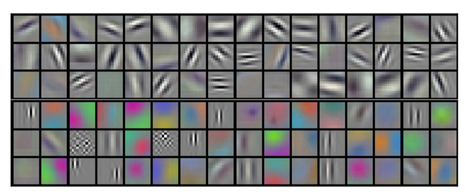
```
](https://cs231n.github.io/convolutional-networks/)
]

???
- In the last couple minutes, we are going to go through a quick example of *convolutional* neural networks, which are the flavor we will be working with most often since they operate on spatial image data.
- The goal remains the same: We are attempting to train a useful set of spatially and informationally hierarchical feature extractors. 
- Here are some example low level filters, which you can appreciate are going to sensitive to edges, orientation, contrast.

---
# Convolutional neural networks

Example 3×3 convolution, no padding, unit stride.

$\begin{bmatrix} 0 & 1 & 2 \\ 2 & 2 & 0 \\ 0 & 1 & 2 \end{bmatrix}$

$3 \cdot 0 + 3 \cdot 1 + 2 \cdot 2 + 0 \cdot 2 + 0 \cdot 2 + 1 \cdot 0 + 3 \cdot 0 + 1 \cdot 1 + 2 \cdot 2 = 12$

[
```{r echo=FALSE, out.width="49%"}
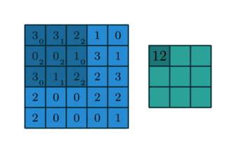
```
](http://deeplearning.net/software/theano/tutorial/conv_arithmetic.html)
```{r echo=FALSE, out.width="30%"}
knitr::include_graphics('img/no_padding_no_strides.gif')
```

???
- Take for instance this 5 by 5 pixel dataset.
- Here in this model we are going to train a 3 by 3 kernel/filter, which after sliding it around and convolving it with our input image, we hope will give us some interesting feature.
- All you do is element-wise multiplication and then sum.
- Let's try it...

---
.center60[
```{r echo=FALSE, out.width="33%"}
img_list = list.files("img/cnn", full.names=TRUE)
knitr::include_graphics(img_list)
```
]

---
# Convolutional neural networks

[
```{r echo=FALSE, out.width="70%"}
knitr::include_graphics('img/numerical_no_padding_no_strides.gif')
```
](http://deeplearning.net/software/theano/tutorial/conv_arithmetic.html)

???
- Here is the result.
- Again, we can see that, by sliding this kernel/filter around, and convolving it with our image, we've extract this feature here.

---
.pull-left[
# Classification
.center[
```{r echo=FALSE, out.width="70%"}
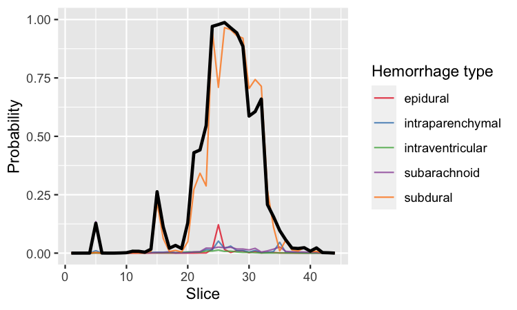
```
```{r echo=FALSE, out.width="50%"}
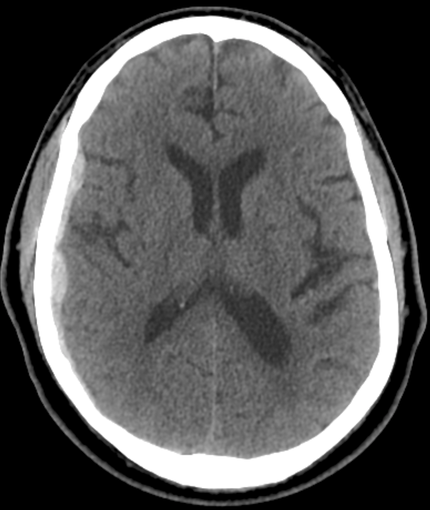
```
]]
.pull-right[.center[
[
```{r echo=FALSE, out.width="70%"}
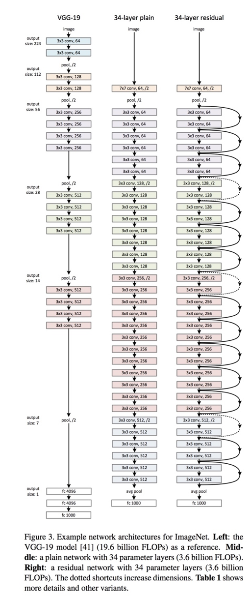
```
](https://arxiv.org/abs/1512.03385)
]]

???
- I will finish with just a little show and tell to demonstrate that by using  what we've learned here for training deep learning based feature detectors, and only swapping out for larger images, larger and complex models, and larger training sets, we can do all of the fun techniques we hear about in the literature.
- CNNs but MANY more layers and channels leads to SOTA classification.
- Here is our heme detector we've been running live on some clinical data.

---
# Object detection
.middle-img[
```{r echo=FALSE, out.width="30%"}
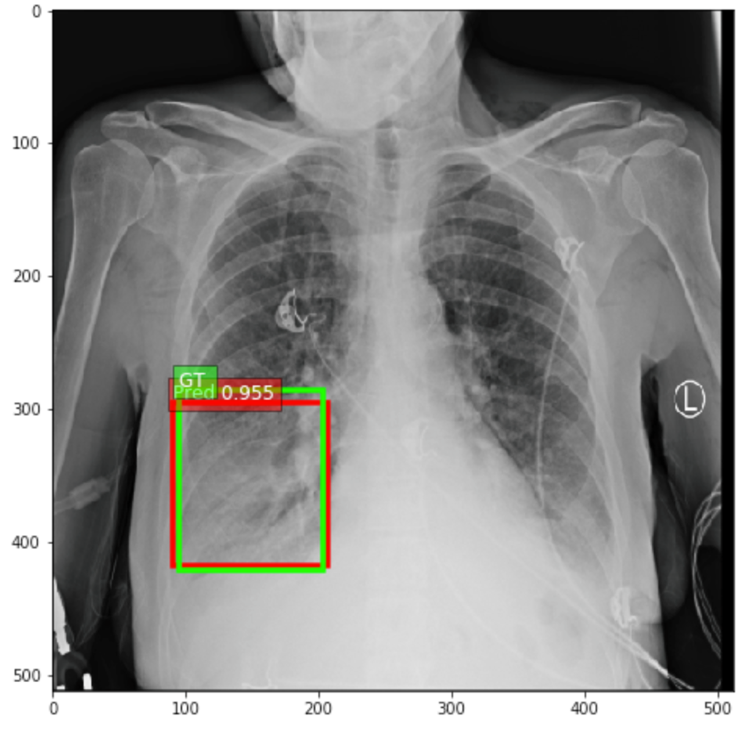
```
[
```{r echo=FALSE, out.width="66%"}
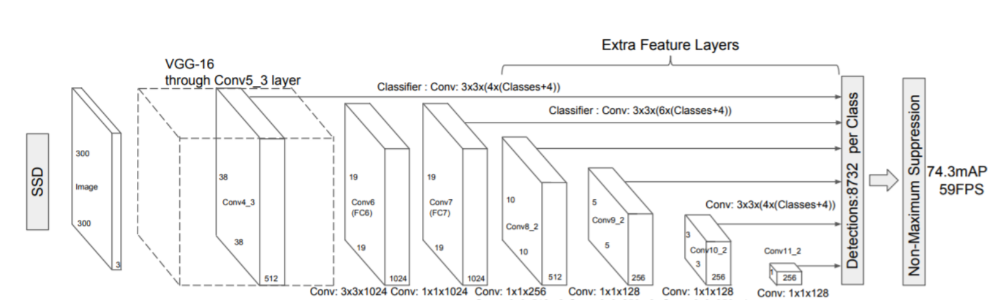
```
](https://towardsdatascience.com/ssd-single-shot-detector-for-object-detection-using-multibox-1818603644ca)
]

???
- If you do some smart up-front preprocessing on the scene, and then do classification, you get object detection.
- Here is some work we did a little while ago on long opacity detection.

---
# Segmentation
.pull-left[.middle-img[
```{r echo=FALSE, out.width="75%"}
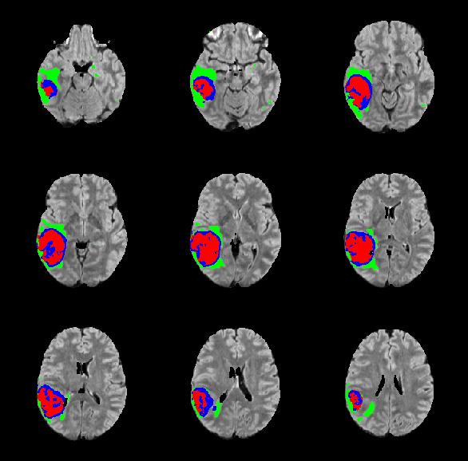
```
]]
.pull-right[.middle-img[
[
```{r echo=FALSE, out.width="100%"}
knitr::include_graphics('img/unet_arch.png')
```
](https://lmb.informatik.uni-freiburg.de/people/ronneber/u-net)
]]

???
- If you use the same feature encoding arm, but then tack on a similar but sort of inverse feature decoding arm, then you can generate pixel based outputs as in segmentation.
- Here is a glioblastoma patient 

---
# Translation

.pull-left[.middle-img[
```{r echo=FALSE, out.width="50%"}
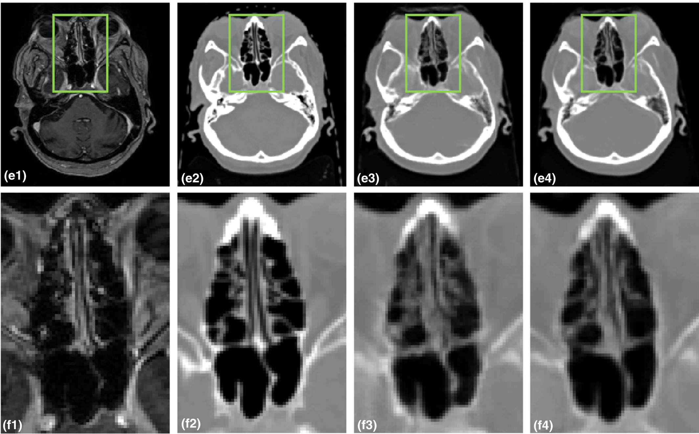
```
]].pull-right[.middle-img[
[
```{r echo=FALSE, out.width="100%"}
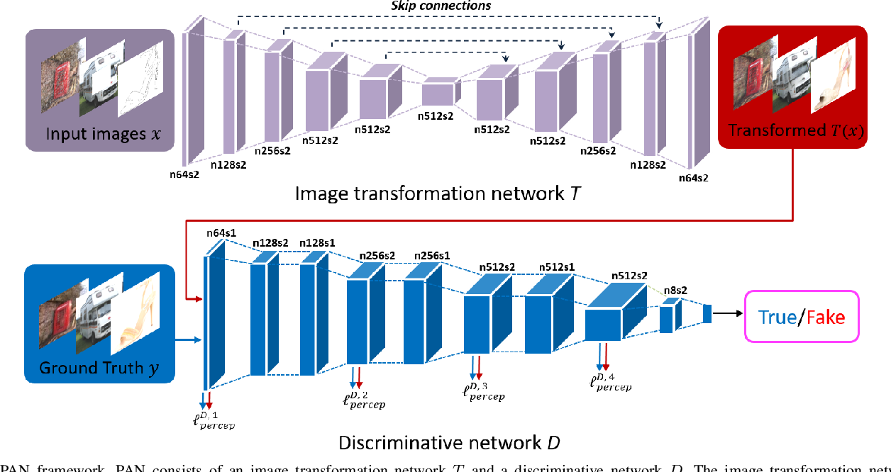
```
](https://arxiv.org/abs/1706.09138)
]]

???
- Finally, if you sort of combine it all and use the pixel-to-pixel u-net architecture we just saw for segmentation, and train that jointly with a discriminator model to judge performance, then you can do more complex image-to-image translation.
- E.g. MRI to synthetic CT.
---
class: center, middle, inverse

# Thanks!
